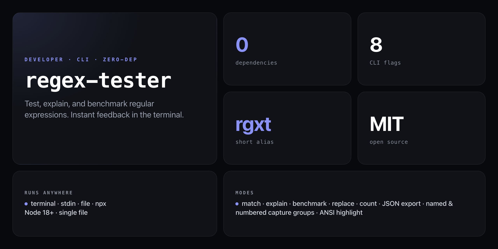

<div align="center">

**Test, match, explain, and benchmark regular expressions. Instant feedback in the terminal — no browser, no account, no install.**


</div>

---

Regex tools live in a browser, expect you to paste one string at a time, and give you no way to pipe them into a build script. `regex-tester` runs entirely in the terminal: feed it strings, a file, or stdin — get back highlighted matches, exact capture group positions, a plain-English explanation of the pattern, and ops/second benchmarks. Scriptable via JSON output and exit codes.

```
$ rgxt "(\w+)@(\w+\.\w+)" "nick@example.com" "admin@cirvgreen.com"

2 matches for /(\w+)@(\w+\.\w+)/g
Input: "nick@example.com"
  Match 1: "nick@example.com"
    Position: 0..16  Length: 16
    Capture groups:
      Group 1: "nick"
      Group 2: "example.com"

Input: "admin@cirvgreen.com"
  Match 1: "admin@cirvgreen.com"
    Position: 0..19  Length: 19
    Capture groups:
      Group 1: "admin"
      Group 2: "cirvgreen.com"

Summary: 2 total matches across 2 inputs
```

## Install

No npm account needed — runs straight from GitHub with zero dependencies:

```bash
npx github:NickCirv/regex-tester
```

Or install the short alias globally:

```bash
npx github:NickCirv/regex-tester --help
# short alias after global install:
# rgxt <pattern> [strings...]
```

## Usage

```
regex-tester <pattern> [strings...] [options]
rgxt         <pattern> [strings...] [options]
```

| Flag | Description |
|------|-------------|
| `--flags <gimsud>` | Regex flags: `g`=global `i`=ignoreCase `m`=multiline `s`=dotAll `u`=unicode (default: `g`) |
| `--replace <str>` | Replace matches; supports `$1`, `$2`, `$<name>` back-references |
| `--file <path>` | Test against each line of a file |
| `--benchmark [n]` | Benchmark N iterations (default: 10 000) — reports ops/second and µs/op |
| `--explain` | Describe the pattern token-by-token in plain English |
| `--json` | Output results as JSON (scriptable) |
| `--count` | Print only total match count |
| `--no-color` | Disable ANSI output |
| `--help` | Show help |

## What it does

### Match with ANSI highlighting

```bash
rgxt "\d+" "abc123def456"
# 2 matches for /\d+/g
#   Match 1: "123"  Position: 3..6  Length: 3
#   Match 2: "456"  Position: 9..12  Length: 3
```

### Named capture groups

```bash
regex-tester "(?<user>\w+)@(?<domain>[\w.]+)" "nick@example.com"
# Match 1: "nick@example.com"
#   Named groups:
#     user:   "nick"
#     domain: "example.com"
```

### Explain mode — plain-English breakdown

```bash
regex-tester "([\w.]+)@([\w.]+)" --explain
# Pattern: /([\w.]+)@([\w.]+)/g
# Explanation:
#    1. [START of a capturing group]
#    2. any character in [\w.] (1 or more times)
#    3. [END of group]
#    4. the literal character "@"
#    5. [START of a capturing group]
#    6. any character in [\w.] (1 or more times)
#    7. [END of group]
```

### Replace mode

```bash
regex-tester "(\w+)@(\w+\.\w+)" "contact user@example.com" --replace "[email redacted]"
# Replaced: "contact [email redacted]"
# (1 replacement)
```

### File and stdin

```bash
# Test each line of a file
regex-tester "^\d{4}-\d{2}-\d{2}$" --file dates.txt --count

# Pipe from any source
cat urls.txt | rgxt "https?://[\w./]+"
echo "foo bar baz" | rgxt "\b\w{3}\b"
```

### Benchmark

```bash
regex-tester "\b\w+\b" "the quick brown fox" --benchmark 100000
# Benchmark  /\b\w+\b/g
#   Iterations:    100,000
#   Total time:    52.3ms
#   Per iteration: 0.523μs
#   Ops/second:    1,912,045
```

### JSON export

```bash
regex-tester "(\w+)@(\w+)" "user@example.com" --json
```

```json
{
  "pattern": "(\\w+)@(\\w+)",
  "flags": "g",
  "totalInputs": 1,
  "totalMatches": 1,
  "results": [
    {
      "input": "user@example.com",
      "matchCount": 1,
      "matches": [
        {
          "match": "user@example",
          "start": 0,
          "end": 12,
          "length": 12,
          "groups": { "1": "user", "2": "example" },
          "namedGroups": {}
        }
      ]
    }
  ]
}
```

## What it is NOT

- **Not an interactive TUI or browser tool.** It is a non-interactive CLI — no live preview as you type. Pipe it, script it, run it in CI.
- **Not a regex library.** It uses Node's built-in `RegExp` engine directly — the patterns and flags that work here are exactly what JavaScript supports.
- **Not a linter or fixer.** It tells you what your pattern matches and how fast; it won't suggest a better pattern.

---

<div align="center">
<sub>Zero dependencies · Node 18+ · MIT · by <a href="https://github.com/NickCirv">NickCirv</a></sub>
</div>
