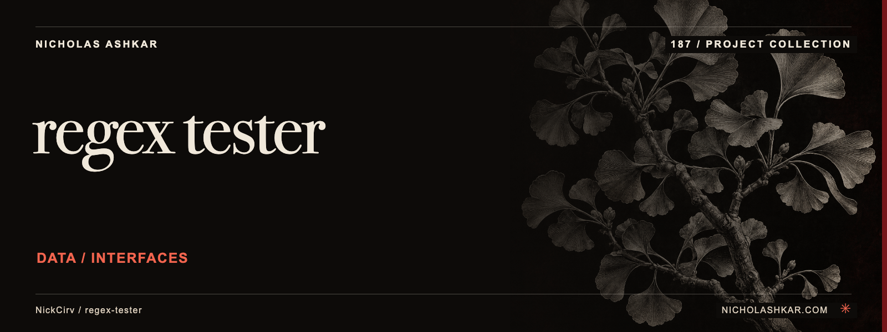

# regex-tester

Test JavaScript regular expressions against strings, files or piped text.

Shows match positions and capture groups, supports replacement output and JSON, and includes a small pattern explainer and repeated-run timing mode.


<a id="install"></a>

## Quickstart

Package runtime requirement: Node.js `>=20`. Git is needed to obtain this pinned source checkout.

```bash
git clone https://github.com/NickCirv/regex-tester.git
cd regex-tester
git checkout 081200a54a83570536eb1cd4088cd7de4220a2d8
node index.js '\d+' 'order 123' --count
```

This source-derived example has not been executed in this review. For this illustrative input, the global pattern has one match. The expected count is derived from the pattern, not a captured run.


<a id="what-it-does"></a>

<a id="match-with-ansi-highlighting"></a>

<a id="named-capture-groups"></a>

<a id="explain-mode--plain-english-breakdown"></a>

<a id="replace-mode"></a>

<a id="file-and-stdin"></a>

<a id="benchmark"></a>

<a id="json-export"></a>

## Usage

```bash
node index.js '(?<name>\w+)' 'hello world' --json
node index.js '\d+' 'order 123' --replace '[number]'
node index.js '^OK' --file lines.txt --flags gm
```

`--flags` defaults to global matching. `--explain` describes recognized syntax. `--benchmark [n]` repeats matching; `--count` prints only the count.

[Command reference](docs/REFERENCE.md) covers arguments, modes and output controls.


<a id="what-it-is-not"></a>

## Behavior and limits

The engine is Node’s JavaScript RegExp, not PCRE or another language’s regex dialect. Explanation is heuristic. Pathological patterns can take a long time; no isolation timeout is established. File mode tests lines separately, which differs from matching an entire file. No LICENSE file is captured despite MIT metadata.

## Development

Declared package scripts:

| Script | Command |
| --- | --- |
| `test` | `node --test` |

The smoke test syntax-checks the entrypoint; it does not exercise CLI behavior or integrations.

## Research

[Source review and claim ledger](docs/RESEARCH.md) records revision `081200a54a83`, inspected files and verification gaps.

## License and attribution

No license file was captured at this revision. A package metadata license field does not supply missing license text; confirm reuse terms before redistribution.

[Artwork credits](assets/nicholas-ashkar/CREDITS.md) · [Nicholas Ashkar — consulting](https://nicholashkar.com/#oxblood-contact)
